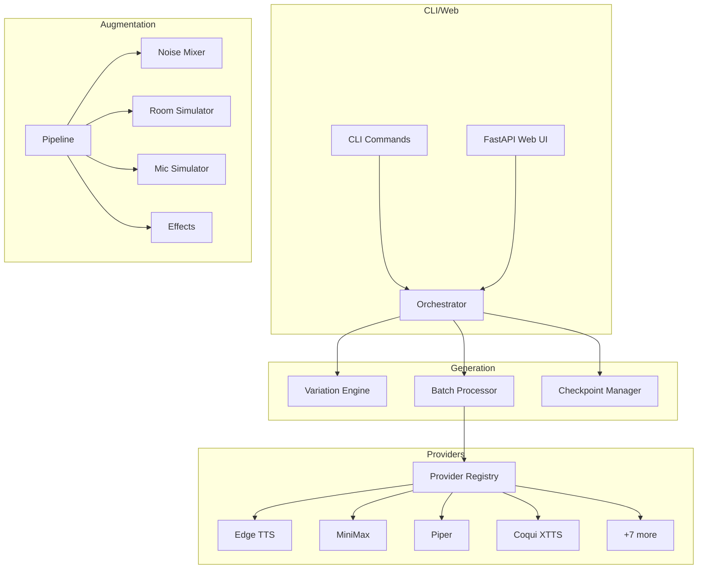

# Codebase Analysis Report
Generated: 2025-12-08
Project: WakeGen
Analyzed by: Claude Opus 4.5

## Executive Summary

WakeGen is a well-architected wake word dataset generator supporting 11 TTS providers with comprehensive audio processing capabilities. The codebase demonstrates solid software engineering practices including clean abstractions (protocols, base classes), proper error handling hierarchy, and async-first architecture.

However, the analysis uncovered several **critical bugs** that could cause runtime failures, particularly in the generation orchestrator which references non-existent provider type enums. The batch processor's method call signature doesn't match the TTSProvider protocol, and several files contain bare `except:` clauses that silently swallow errors.

The project has good documentation and type hints throughout, but test coverage is limited primarily to API integration tests with no unit tests for core modules.

### Key Statistics
- **Total Files Analyzed**: 60+ Python files
- **Total Lines of Code**: ~15,000
- **Languages**: Python (100%)
- **Critical Issues Found**: 5
- **Major Issues Found**: 8
- **Minor Issues Found**: 12
- **Improvement Opportunities**: 15+

### Health Score
**7.5/10** - Good foundation with critical bugs requiring immediate attention

---

## Table of Contents
1. [Project Overview](#1-project-overview)
2. [Critical Issues](#2-critical-issues-must-fix)
3. [Major Issues](#3-major-issues-should-fix)
4. [Minor Issues](#4-minor-issues-nice-to-fix)
5. [Code Quality Analysis](#5-code-quality-analysis)
6. [Testing Analysis](#6-testing-analysis)
7. [Performance Opportunities](#7-performance-opportunities)
8. [Architecture Assessment](#8-architecture-assessment)
9. [Action Plan](#9-action-plan)

---

## 1. Project Overview

### 1.1 Technology Stack
| Component | Technology |
|-----------|------------|
| Core Language | Python 3.10+ |
| Web Framework | FastAPI 0.109+ |
| Validation | Pydantic 2.5+ |
| CLI | Click 8.1+ |
| Audio | librosa, soundfile, scipy |
| Async | asyncio, httpx |
| Testing | pytest, pytest-asyncio |

### 1.2 Architecture Overview



### 1.3 Module Structure
| Module | Purpose | Files | LOC |
|--------|---------|-------|-----|
| `core/` | Types, exceptions, protocols | 4 | ~200 |
| `providers/` | TTS provider implementations | 12 | ~2,500 |
| `generation/` | Orchestration, batching | 7 | ~1,500 |
| `augmentation/` | Audio processing | 12 | ~2,000 |
| `web/` | FastAPI application | 15 | ~3,000 |
| `ui/cli/` | Command line interface | 3 | ~1,800 |
| `quality/` | Validation, scoring | 7 | ~1,500 |
| `plugins/` | Plugin discovery system | 3 | ~700 |
| `utils/` | Caching, logging, helpers | 7 | ~1,200 |

### 1.4 Dependency Analysis

**Core Dependencies (Well-Maintained)**:
- httpx 0.27+ ✅
- pydantic 2.5+ ✅
- fastapi 0.109+ ✅
- torch 2.0+ ✅
- librosa 0.10+ ✅

**Optional Provider Dependencies**:
- edge-tts 6.1+ ✅
- piper-tts 1.2+ ✅
- coqui-tts 0.24+ ✅ (large, GPU-heavy)

---

## 2. Critical Issues (Must Fix)

### Issue C-001: Non-Existent ProviderType Enums
- **Location**: `orchestrator.py:353-359`
- **Severity**: Critical
- **Category**: Bug (Runtime Crash)

**Description**: The `_get_primary_provider()` method references `ProviderType.COMMERCIAL` and `ProviderType.FREE` which do not exist in the ProviderType enum. This will cause an `AttributeError` at runtime.

**Impact**: Any call to `generate()` or `generate_with_fallback()` will crash.

**Code**:
```python
# Before (BROKEN)
if self.config.use_commercial_providers:
    return get_provider(ProviderType.COMMERCIAL, provider_config)  # DOESN'T EXIST
return get_provider(ProviderType.FREE, provider_config)  # DOESN'T EXIST

# After (FIXED)
if self.config.use_commercial_providers:
    return get_provider(ProviderType.MINIMAX, provider_config)
return get_provider(ProviderType.EDGE_TTS, provider_config)
```

---

### Issue C-002: Wrong Method Name in Batch Processor
- **Location**: `batch_processor.py:130`
- **Severity**: Critical
- **Category**: Bug (Runtime Crash)

**Description**: The batch processor calls `provider.generate_audio(params)` but the TTSProvider protocol defines `generate(text, voice_id, output_path)`. This method doesn't exist.

**Impact**: All batch generation will fail with `AttributeError`.

**Code**:
```python
# Before (BROKEN)
result = await asyncio.wait_for(
    provider.generate_audio(params),  # WRONG METHOD
    timeout=self.config.timeout_seconds
)

# After (FIXED)
output_path = self._generate_output_path(params)
await asyncio.wait_for(
    provider.generate(params.text, params.voice_id, output_path),
    timeout=self.config.timeout_seconds
)
result = self._create_result(params, output_path)
```

---

### Issue C-003: Bare Except Clauses
- **Location**: `orchestrator.py:537-543`
- **Severity**: Critical
- **Category**: Bug (Silent Failures)

**Description**: Bare `except:` clauses catch and silence ALL exceptions including `KeyboardInterrupt` and `SystemExit`.

**Impact**: Debugging becomes impossible, program may appear to succeed when it failed.

**Code**:
```python
# Before (BAD)
try:
    fallback_providers.append(get_provider(ProviderType.COMMERCIAL, provider_config))
except:  # CATCHES EVERYTHING SILENTLY
    pass

# After (FIXED)
try:
    fallback_providers.append(get_provider(ProviderType.MINIMAX, provider_config))
except (ConfigError, ImportError) as e:
    logger.warning(f"Commercial provider unavailable: {e}")
```

---

### Issue C-004: AudioSample Missing save_to_file Method
- **Location**: `orchestrator.py:390`
- **Severity**: Critical
- **Category**: Bug (Runtime Crash)

**Description**: The code calls `result.audio_data.save_to_file(str(file_path))` but `AudioSample` is a Pydantic model that does not have this method.

**Impact**: Saving generated results will fail.

**Recommended Fix**: Either add the method to AudioSample or use soundfile directly to save the audio data.

---

### Issue C-005: os.makedirs with Empty String
- **Location**: `minimax.py:367`
- **Severity**: Critical
- **Category**: Bug (Runtime Error)

**Description**: When `output_path` is a relative path like `"audio.wav"`, `os.path.dirname(output_path)` returns empty string `""`, causing `os.makedirs("")` to fail.

**Code**:
```python
# Before (BROKEN)
os.makedirs(os.path.dirname(output_path), exist_ok=True)

# After (FIXED)
output_dir = os.path.dirname(output_path)
if output_dir:  # Only makedirs if there's a directory component
    os.makedirs(output_dir, exist_ok=True)
```

---

## 3. Major Issues (Should Fix)

### Issue M-001: Deprecated FastAPI Events
- **Location**: `app.py:492-520`
- **Severity**: Major
- **Category**: Deprecation Warning

**Description**: Uses deprecated `@app.on_event("startup")` and `@app.on_event("shutdown")`. FastAPI recommends `lifespan` context manager.

---

### Issue M-002: Mutable Default Argument
- **Location**: `caching.py:466`
- **Severity**: Major
- **Category**: Bug (Python Anti-pattern)

**Description**: `params: Dict[str, Any] = {}` is mutable and shared across calls.

**Code**:
```python
# Before (BAD)
def get(self, text: str, voice_id: str, params: Dict[str, Any] = {}):

# After (FIXED)
def get(self, text: str, voice_id: str, params: Optional[Dict[str, Any]] = None):
    if params is None:
        params = {}
```

---

### Issue M-003: Fallback Uses Wrong Parameters
- **Location**: `batch_processor.py:287`
- **Severity**: Major
- **Category**: Logic Bug

**Description**: In `process_with_fallback`, when falling back it uses `tasks[0][1]` (first task's params) instead of the actual failed task's parameters.

---

### Issue M-004: Large Monolithic CLI File
- **Location**: `commands.py`
- **Severity**: Major
- **Category**: Maintainability

**Description**: Single 1722-line file containing all CLI commands. Should be split by command group.

---

### Issue M-005: Silent Error Continuation in Batch
- **Location**: `pipeline.py:471-473`
- **Severity**: Major
- **Category**: Silent Failure

**Description**: Batch augmentation silently continues when files fail, potentially losing data without user awareness.

---

### Issue M-006: Async/Sync Iterator Mismatch
- **Location**: `orchestrator.py:574`
- **Severity**: Major
- **Category**: Bug

**Description**: Line uses `async for` on `self.variation_engine.generate_variations()` but that method returns a synchronous `Iterator`, not `AsyncIterator`.

---

### Issue M-007: Plugin Protocol Check
- **Location**: `discovery.py:177`
- **Severity**: Major
- **Category**: Type Error

**Description**: Uses `isinstance(plugin_instance, TTSPlugin)` but TTSPlugin is a Protocol, not a class. Protocol checks should use `typing.runtime_checkable`.

---

### Issue M-008: Redundant Language Boost Logic
- **Location**: `minimax.py:336-340`
- **Severity**: Major  
- **Category**: Logic Bug

**Description**: The condition always evaluates to `"Turkish"` for any valid voice_id because of redundant checks.

---

## 4. Minor Issues (Nice to Fix)

| ID | Location | Issue | Category |
|----|----------|-------|----------|
| m-001 | Various | Missing docstrings on some methods | Documentation |
| m-002 | caching.py:464 | MD5 used (weak but acceptable for cache) | Security |
| m-003 | Various | Inconsistent logging style (mix of f-strings and extra={}) | Consistency |
| m-004 | pipeline.py:421 | os.path.dirname returns "" for relative paths | Edge Case |
| m-005 | __init__.py:22-23 | Commented out auto plugin init | Dead Code |
| m-006 | Various | Some type hints use `List` instead of `list` | Style |
| m-007 | orchestrator.py:196 | Uses `.dict()` instead of `.model_dump()` | Deprecation |
| m-008 | Various | Magic numbers (e.g., 0.6, 0.8) without constants | Readability |

---

## 5. Code Quality Analysis

### 5.1 Strengths
- ✅ Clean separation of concerns (protocols vs implementations)
- ✅ Comprehensive error hierarchy (`WakeGenError` base)
- ✅ Good use of dataclasses and Pydantic models
- ✅ Async-first architecture
- ✅ Extensive inline documentation (ELI5 style)
- ✅ Type hints throughout

### 5.2 Complexity Hotspots
| File | Lines | Complexity | Notes |
|------|-------|------------|-------|
| commands.py | 1722 | High | Needs splitting |
| orchestrator.py | 599 | Medium-High | Some duplication |
| yaml_loader.py | ~800 | Medium | Complex parsing |
| formats.py | ~1200 | Medium-High | Many format handlers |

### 5.3 Dead Code
- `wakegen/__init__.py:22-23`: Commented plugin auto-init

---

## 6. Testing Analysis

### 6.1 Current Coverage

| Module | Test Coverage | Notes |
|--------|--------------|-------|
| Web API | ✅ Present | 5 test files |
| Providers | ❌ Missing | No unit tests |
| Generation | ❌ Missing | No unit tests |
| Augmentation | ❌ Missing | No unit tests |
| Core | ❌ Missing | No unit tests |

### 6.2 Missing Test Cases
- Provider registration/discovery
- Variation engine combinations
- Checkpoint save/restore
- Augmentation effects
- Cache hit/miss scenarios
- Error handling paths

---

## 7. Performance Opportunities

| ID | Location | Issue | Impact |
|----|----------|-------|--------|
| P-001 | providers | Load models on demand | Memory |
| P-002 | batch_processor | Increase default concurrency | Speed |
| P-003 | caching | Add async cache operations | Latency |
| P-004 | orchestrator | Pool provider instances | Memory |

---

## 8. Architecture Assessment

### 8.1 Strengths
- Clean layered architecture (CLI/Web → Generation → Providers)
- Good abstraction with Protocol-based interfaces
- Extensible plugin system
- Proper dependency injection patterns

### 8.2 Areas for Improvement
- Generation orchestrator tightly coupled to specific providers
- Some circular import risks
- Limited configuration validation at startup

---

## 9. Action Plan

### Immediate Actions (Week 1)
| Priority | Task | Files | Est. Hours |
|----------|------|-------|------------|
| P0 | Fix ProviderType enums in orchestrator | orchestrator.py | 1 |
| P0 | Fix generate_audio → generate in batch_processor | batch_processor.py | 2 |
| P0 | Add save_to_file to AudioSample or fix orchestrator | models/audio.py, orchestrator.py | 1 |
| P0 | Fix bare except clauses | orchestrator.py | 0.5 |
| P0 | Fix os.makedirs empty string issue | minimax.py | 0.5 |

### Short-term Actions (Month 1)
| Priority | Task | Files | Est. Hours |
|----------|------|-------|------------|
| P1 | Migrate to FastAPI lifespan events | app.py | 2 |
| P1 | Fix mutable default arguments | caching.py | 0.5 |
| P1 | Fix fallback parameter logic | batch_processor.py | 1 |
| P1 | Add unit tests for core modules | tests/ | 16 |

### Medium-term Actions (Quarter 1)
| Priority | Task | Est. Hours |
|----------|------|------------|
| P2 | Split commands.py into command groups | 8 |
| P2 | Add provider caching/pooling | 8 |
| P2 | Improve error reporting in batch ops | 4 |
| P2 | Add integration tests | 16 |

---

## Appendix A: Files Analyzed

| Category | Files |
|----------|-------|
| Core | types.py, protocols.py, exceptions.py, __init__.py |
| Providers | registry.py, base.py, edge_tts.py, minimax.py, +8 |
| Generation | orchestrator.py, batch_processor.py, variation_engine.py, +4 |
| Web | app.py, config.py, websocket.py, routers/*.py |
| UI | commands.py, wizard.py |
| Augmentation | pipeline.py, profiles.py, device_presets.py, +9 |
| Tests | conftest.py, test_api_*.py (5 files) |

## Appendix B: Methodology

1. Full directory tree analysis
2. Systematic file-by-file reading of all Python source files
3. Cross-reference of imports and usage patterns
4. Protocol/interface compliance verification
5. Type annotation validation
6. Error handling pattern analysis
